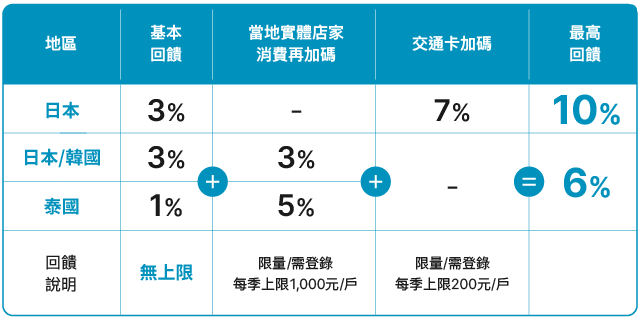

# 行程中購物資訊及地點整理

## 機場購物相關

- 松本清成田機場店位置 (第 1 航廈 3F 安檢後) - ✅ 機場免稅店

## 親子友善購物地點

- **D1 松本清成田機場店** - **12:25-14:00** - 嬰兒用品、藥品、日用品（營業時間：07:30-21:00）- ✅ 機場免稅店
- **D1 淺草仲見世通** - **16:35-17:15** - 傳統小食、土產 - ⚠️ 傳統商店街小店舖一般不提供免稅
  - 淺草吉備糰子 AZUMA、淺草炸肉餅、龜十銅鑼燒、仲見世杵屋（仙貝米果）、浅草よ兵衛（烤糰子）
- **D1 淺草西松屋店 + 3coins** - **18:20-20:20** - 嬰兒用品、寶寶背巾（重要採購）+ 生活雜貨 - ✅ 西松屋提供免稅；3coins 特定分店提供免稅
  - **西松屋**（18:20-19:50）：位置淺草ROX・3G購物中心4樓，營業時間 10:30-21:00 - ✅ 提供免稅服務
  - 可購買：背巾、尿布、奶瓶、嬰兒服裝、玩具等
  - **3coins**（19:55-20:20）：300日圓均一價商品，生活雜貨、收納用品、旅行用品 - ✅ 特定分店提供免稅
- **D2 錦糸町阿卡醬** - **10:00-11:20** - 嬰兒用品採購（10:00-21:00營業）- ✅ 大型嬰兒用品專賣店提供免稅
  - **重要**：21:00 關門，需把握購物時間
  - **可購買**：嬰兒服裝、推車、寢具、尿布、離乳食、玩具等
- **D2 晴空塔城購物** - **17:25-18:25** - 東京特產、紀念品採購 - ✅ 大型購物中心提供免稅服務
  - **設施**：超過 300 間商店，免稅服務，多語言支援
  - **親子友善**：行李寄存、託嬰服務、購物推車租借
- **D3 博品館銀座本店** - **14:00-16:55** - 玩具採購，20 萬件以上玩具 - ✅ 大型玩具專賣店提供免稅
  - 位置：東京都中央區銀座 8-8-11，營業時間：11:00-20:00
  - B1F：Licca-chan、時尚娃娃與 3D 模型體驗
  - 1F：文具、派對周邊、生活雜貨
  - 2F：15,000+ 絨毛玩偶（迪士尼、吉卜力、寶可夢角色）
  - 3F：LEGO、Tomica、有教育性童玩與木製軌道區
  - 4F：桌遊、拼圖、模型與 slot-car 賽道玩體驗（200 円／5 分鐘）
- **D3 銀座其他購物選項**：
  - **Seria 銀座店**：100 圓商品，位於銀座區域 - ⚠️ 小型店舖一般不提供免稅服務
  - **3coins**：生活雜貨 - ✅ 銀座等特定分店提供免稅
  - **UNIQLO 旗艦店**：服飾 - ✅ 所有店舖提供免稅服務
  - **寶可夢咖啡廳+寶可夢中心 DX 店**：主題商品 - ✅ 寶可夢中心提供免稅
- **D4 台場購物日**： 台場 AQUA CITY、DiverCity、DECKS Tokyo Beach 嬰兒用品採購 - ✅ 大型購物中心群提供免稅服務
  - **DECKS Tokyo Beach 西松屋台場店** - **10:10-12:10** - ✅ 已查證：11:00-20:00（平日），專業嬰兒用品 - ✅ 提供免稅服務
  - **DiverCity Kirakira Donki + DAISO** - **13:10-15:10** - ✅ 已查證：11:00-20:00（平日），特色唐吉訶德 + 百元商品 - ✅ 大型店舖提供免稅
  - **AQUA CITY Air BIC CAMERA** - **15:10-17:10** - ✅ 已查證：11:00-21:00，電器用品、相機、旅遊配件 - ✅ 大型電器連鎖店提供免稅
  - **台場最後購物** - **19:35-20:00** - 土產、紀念品、零食 - ✅ 台場購物中心提供免稅服務

## 台場購物整理（D4 詳細資訊）

- **D4 豐洲市場** - **10:15-11:45** - 新鮮海產市場觀光體驗 - ⚠️ 市場小商家一般不提供免稅
- **D4 SMALL WORLDS TOKYO** - **12:05-14:00** - 東京迷你世界博物館 - ⚠️ 門票景點不提供免稅
- **D4 DECKS Tokyo Beach** - **14:31-16:21** - 台場海濱購物中心 - ✅ 大型購物中心提供免稅
  - **西松屋台場店**：營業時間 11:00-20:00（平日），11:00-21:00（週末）- ✅ 提供免稅服務
  - **台場一丁目商店街**：雜貨、紀念品 - ⚠️ 小型商店街一般不提供免稅
- **D4 DiverCity Tokyo Plaza** - **16:26-18:21** - 鋼彈立像 + 購物 - ✅ 大型購物中心提供免稅
  - **鋼彈立像**：親子拍照景點 - ⚠️ 景點不提供免稅
  - **Kirakira Donki**：特色唐吉訶德分店，社交媒體熱門商品 - ✅ 大型店舖提供免稅
  - **DAISO 大店**：百元商品、日用品採買 - ✅ 大型店舖提供免稅
- **D4 AQUA CITY ODAIBA** - **19:21-20:16** - 台場大型購物中心 - ✅ 大型購物中心提供免稅
  - **Air BIC CAMERA**：營業時間 11:00-21:00，電器用品、相機、旅遊配件 - ✅ 大型電器連鎖店提供免稅
  - **嬰兒用品專區**：尿布、奶瓶、嬰兒服裝 - ✅ 大型購物中心內提供免稅

### D4 台場採買動線建議

1. **DECKS Tokyo Beach**（デックス東京ビーチ）
   - **西松屋台場店**： 嬰兒用品專門店 - ✅ 提供免稅服務
   - **台場一丁目商店街**： 雜貨、紀念品 - ⚠️ 小型商店街一般不提供免稅
   - **台場海濱公園站** 附近

2. **DiverCity Tokyo Plaza**（ダイバーシティ東京プラザ）
   - **鋼彈立像**（ガンダム立像）：親子拍照景點 - ⚠️ 景點不提供免稅
   - **Kirakira Donki**： 特色唐吉訶德，社交媒體熱門商品 - ✅ 大型店舖提供免稅
   - **DAISO 大店**： 百元商品、日用品採買 - ✅ 大型店舖提供免稅
   - **東京電信站** 附近

3. **AQUA CITY ODAIBA**（アクアシティお台場）
   - **[BIC CAMERA](https://bobbyfun.tw/2024-01-25-2807/)**： 電器用品、相機、旅遊配件 - ✅ 大型電器連鎖店提供免稅
   - **嬰兒用品專區**： 尿布、奶瓶、嬰兒服裝 - ✅ 大型購物中心內提供免稅
   - **台場站** 附近

### D4 台場嬰兒用品採買建議

**台場地區最佳選擇**：

- **西松屋台場店**： 專業嬰兒用品連鎖店，品項最齊全，價格實惠 - ✅ 提供免稅服務
- **AQUA CITY 嬰兒用品店**： 台場最大的嬰兒用品專賣店 - ✅ 大型購物中心提供免稅
- **[BIC CAMERA](https://bobbyfun.tw/2024-01-25-2807/) 嬰兒用品區**： 電子產品和嬰兒用品一站購足 - ✅ 大型電器連鎖店提供免稅
- **Kirakira Donki（DiverCity 內）**： 化妝品、糖果、社交媒體熱門商品 - ✅ 大型店舖提供免稅

## 輕井澤購物整理

- **D5 舊輕井澤銀座通** - **14:05-16:00** - 輕井澤經典購物街 - ⚠️ 小型商店街一般不提供免稅
  - **諏訪神社參拜**：14:05-14:20
  - **SAWAYA 果醬店品嚐**：14:20-14:40
  - **自由逛街購物**：14:40-16:00
  - **推薦店舖**：輕井澤駝美館（KARUIZAWA BAKERY）歐式麵包店、ピエール エルメ（Pierre Herme）法式甜點 - ⚠️ 小型麵包店一般不提供免稅

## 輕井澤餐飲購物補充

- **D6 珈琲館旦念亭** - **08:20-09:10** - 1978 年創立老牌咖啡館 - ⚠️ 小型咖啡館一般不提供免稅
  - 位置：JR 軽井沢駅北口步行 2 分鐘
  - 特色：水滴咖啡、晨食套餐、4 日巧克力蛋糕
- **D6 詩紀厸廊峰（味の街）** - **13:00-14:00** - 輕井澤 Outlet 味之街餐廳 - ⚠️ 餐廳一般不提供免稅
  - 位置：輕井澤 Prince Shopping Plaza 味の街區域
  - 特色：信州小麥、天婦羅、當地特色料理
- **D6 日本料理 かつ一** - **13:00-14:00** - 輕井澤 Outlet 內日式餐廳 - ⚠️ 餐廳一般不提供免稅
  - 位置：輕井澤 Prince Shopping Plaza 內
  - 特色：日式定食、炸豬排、適合家庭用餐
- **D6 沢村 (Sawamura)** - **18:32-19:32** - 知名麵包店附設餐廳 - ⚠️ 小型餐廳一般不提供免稅
  - 位置：舊輕井澤銀座通
  - 特色：歐式料理、可外帶麵包當早餐
- **D7 榆樹街小鎮（ハルニレテラス）** - **12:25-13:20** - 森林氛圍購物用餐 - ⚠️ 小型精品店舖一般不提供免稅
  - **營業時間**：商店 10:00-18:00，餐廳 11:00-22:00
  - **推薦**：丸山咖啡（09:00-19:00）- ⚠️ 小型咖啡店一般不提供免稅
  - **特色**：森林環境中的精品店舖和咖啡廳

## 最後購物機會

- **D8 輕井澤王子 Outlet** - **10:50-12:25** - 最後採購機會
  - **購物時間**：約 95 分鐘，充分利用最後機會
  - **距離**：距離酒店約 1.1 公里，步行約 15-20 分鐘
  - **注意**：體育之日特別注意人潮
  - **免稅**：✅ 大型 Outlet 提供免稅服務，單店單日購物滿 5,000 日圓（未稅）可申請免稅
- **D8 成田機場免稅購物** - **18:20-20:00** - 機場免稅店購物
  - **時間**：預留充分時間進行免稅購物與用餐
  - **免稅**：✅ 機場免稅店提供完整免稅服務

## 🔥 免稅服務總整理

### ✅ 提供免稅服務的商家

- **松本清成田機場店**：✅ 機場免稅店
- **博品館銀座本店**：✅ 大型玩具專賣店，可申請免稅
- **西松屋各店（淺草店、台場店）**：✅ 大型連鎖嬰兒用品店
- **阿卡醬錦糸町店**：✅ 大型嬰兒用品專賣店
- **晴空塔城購物**：✅ 大型購物中心提供免稅服務
- **台場購物中心群（AQUA CITY、DiverCity、DECKS）**：✅ 大型購物中心
- **BIC CAMERA**：✅ 大型電器連鎖店
- **DAISO 大店**：✅ 部分大型店舖提供免稅
- **UNIQLO 旗艦店**：✅ 所有店舖提供免稅服務
- **3coins 銀座等特定分店**：✅ 特定分店提供免稅
- **寶可夢中心**：✅ 提供免稅服務
- **輕井澤王子 Outlet**：✅ 大型 Outlet 購物中心
- **成田機場免稅店**：✅ 機場免稅店

### 📋 免稅購物條件（2025 年）

- **資格**：非日本居民的外國人
- **最低金額**：單店單日購物滿 5,000 日圓（未稅）
- **稅率**：可節省 10% 消費稅
- **攜帶**：免稅商品須隨身攜帶出境（不可分開寄送）

### 信用卡資訊

#### [JCB 優惠](https://www.specialoffers.jcb/zh-tw/campaign/d/east-asia/japan/?c=retail_store)

#### [聯邦吉鶴](https://activity.ubot.com.tw/2025JiHoCard-Japan/index.htm)

- **7%**=日幣消費「2.5%」(無上限)+QUICPay「1.5%」(1000/月)+活動「3%」（活動期間上限600）
  - 消費上限 NTD66,666/JPY322,303/月，NTD20,000/JPY96,691/季
- 指定商店：**QUICPay（apple pay）**、7-ELEVEN、FamilyMart、LAWSON、永旺、三越、高島屋、BIC CAMERA、愛電王、多慶屋

#### [玉山熊本熊](https://event.esunbank.com.tw/credit/kumamon-card/index.html)

- **8.5%**=日本消費「2.5%」（無上限）+指定日本商店加碼「6%」（500/月）
  - 消費上限 NTD8,333/JPY40,356/月
- 指定商店：NIPPON RENT-A-CAR、BIC CAMERA、Yodobashi、松本清、唐吉軻德、大國藥妝、無印、niko and…、3 coins、DOUTOR Coffee、Fuglen、松屋、SUKIYA、勝烈亭、敘敘苑、牛角、shake shack、壽司郎、藏壽司
- **5%(paypay by wallet)**= 3.5%（100/季）+1.5% 免稅
  - 消費上限 NTD2,857/JPY13,813/季

#### [富邦J卡](https://www.fubon.com/banking/Personal/credit_card/all_card/omiyage/omiyage.htm)

- **10%**=日本消費「3%」（無上限）+ 交通卡加碼「7%」（需單筆滿2000, 200/季）
  - 消費上限 NTD2,857/JPY13,813/季
- **6%**=日本消費「3%」（無上限）+ 日韓加碼「3%」
  - 消費上限 NTD33,333/JPY161,152/季

#### 使用策略

- 機場免稅店：[JCB QRcode](#jcb-優惠)
- 藥妝：[JCB QRcode](#jcb-優惠)
- 西瓜儲值（by apple pay）
  1. [玉山熊本熊](#玉山熊本熊)
  2. [富邦J](#富邦j卡)
  3. [聯邦吉鶴](#聯邦吉鶴)：免收 1.5% 國外交易服務費
- BIC CAMERA
  1. [玉山熊本熊](#玉山熊本熊)
     - [**BIC CAMERA** 使用優惠券再享電器**7%**藥妝**5%**](https://event.esunbank.com.tw/credit/1120427bic/images/BicCamera-coupon.jpg)
  2. [聯邦吉鶴](#聯邦吉鶴)
- 多慶屋
  1. [聯邦吉鶴](#聯邦吉鶴)
     - [**多慶屋**消費滿5000提供條碼再享**10%免稅+12%折扣**](https://activity.ubot.com.tw/aws_act/2025/2025TAKEYA/index.htm)
- 日本銀座樂天免稅店
  1. [富邦J](#富邦j卡)
     - 優惠碼 滿 10000 折 1000, 20000 折 2000
- 完美行(每張卡都一樣)
  1. [聯邦吉鶴](#聯邦吉鶴)，刷卡並使用以下代碼
     - 滿15000：NJ3UBF
     - 滿60000：KSN533
